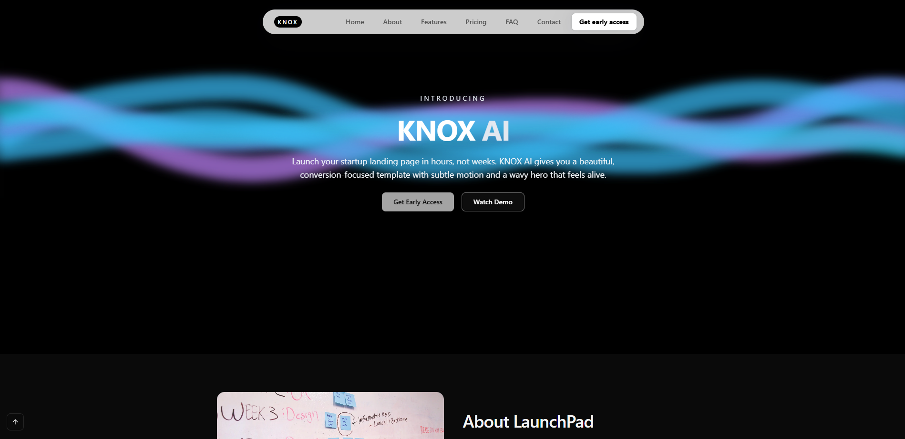

## KNOX AI — SaaS Landing Page (Practice Project)



KNOX AI is a **practice landing page** for a fictional AI startup.  
The goal of this project is to experiment with a modern marketing site stack:

- Animated hero with canvas-based waves
- Smooth entrance animations
- Responsive, scroll-aware navbar
- Feature & pricing sections using shadcn/ui
- FAQ accordion and contact form with API route + toast feedback

It is **not** a production application, but it’s structured like a real-world Next.js app so it can be deployed and iterated on.

---

## Features

- **Hero section**
  - Wavy background built with a custom `WavyBackground` component (canvas + simplex-noise).
  - Name animation using `EncryptedText` to reveal the “KNOX” brand.
  - Primary and secondary CTAs:
    - **Get Early Access** — triggers a Sonner toast confirming you’re on the list.
    - **Watch Demo** — toast describing that a demo is coming soon.

- **Responsive navigation**
  - Custom resizable navbar component with:
    - Desktop and mobile layouts
    - Animated hover pill for links
    - Mobile drawer controlled via a toggle icon
  - Links scroll to `Home`, `About`, `Features`, `Pricing`, `FAQ`, and `Contact`.

- **About section**
  - Two-column layout with copy on one side and an image on the other using `next/image`.
  - Shows a “founders at work” style photo from the `public/` folder.

- **Features section**
  - Grid of cards using shadcn `Card`.
  - Each card has:
    - Numbered badge
    - Title and description
    - Subtle hover elevation + border highlight
  - Animated on scroll with Framer Motion.

- **Pricing section**
  - Three-column pricing table (`Starter`, `Growth`, `Scale`).
  - Middle plan marked as **Popular** and visually highlighted:
    - Larger elevation/shadow
    - Slight vertical lift on desktop
  - Each plan includes:
    - Price per month
    - CTA “Get Started” button
    - Feature list with check icons.

- **FAQ section**
  - Accordion-based FAQ using shadcn `Accordion`, `AccordionItem`, `AccordionTrigger`, and `AccordionContent`.
  - Four sample questions covering onboarding, timelines, and growth.

- **Contact section**
  - Contact form built with shadcn `Input`, `Textarea`, and `Button`.
  - Fields: **Name**, **Email**, **Tell us about your startup**.
  - Styled inside a `Card` for a clean, focused form.
  - Backed by a minimal API route (`app/api/contact/route.ts`) that:
    - Validates required fields
    - Is ready to be wired into email and WhatsApp integrations later.

- **Scroll-to-top control**
  - Fixed “back to top” icon button in the bottom-left corner.
  - Smooth-scrolls back to the hero when clicked.

- **Theming & typography**
  - Custom neutral dark theme wired via CSS variables in `app/globals.css`.
  - Uses `Geist` and `Fenix` fonts with `next/font`.

---

## Tech Stack

- **Framework**: [Next.js 16 (App Router)](https://nextjs.org)
- **Styling**: Tailwind CSS (v4-style `@import "tailwindcss"` + design tokens in `globals.css`)
- **UI Components**: [shadcn/ui](https://ui.shadcn.com)
- **Animation**: [framer-motion](https://www.framer.com/motion/)
- **Notifications**: [Sonner](https://sonner.emilkowal.ski) for toasts
- **Icons**: [lucide-react](https://lucide.dev)
- **Custom Canvas Effect**: `simplex-noise` for hero waves
- **Forms & API**: Next.js Route Handler (`app/api/contact/route.ts`)

---

## Getting Started (local)

First, run the development server:

```bash
npm run dev
# or
yarn dev
# or
pnpm dev
# or
bun dev
```

Open [http://localhost:3000](http://localhost:3000) with your browser to see the result.

You can start editing the page by modifying `app/page.tsx`. The page auto-updates as you edit the file.

Key project entry points:

- `app/page.tsx` — main landing page layout and sections
- `app/api/contact/route.ts` — backend route for the contact form
- `components/ui/*` — reusable UI components (navbar, cards, accordion, wavy background, encrypted text, etc.)
- `app/globals.css` — theme tokens (background, primary, text colors, radii)

---

## Deployment

This project is intended for practice, but it can be deployed easily to [Vercel](https://vercel.com):

1. Push the repo to GitHub.
2. Create a new project in Vercel and select this repo.
3. Use the default Next.js settings (`npm run build` as the build command).

Vercel will run the build and host both the static pages and the `/api/contact` route.

---

## TODO / Possible Improvements

This is a learning project, so there are plenty of possible upgrades:

- Wire the contact form to a real email provider (Resend, SendGrid, etc.) and WhatsApp notifications.
- Add real authentication and a dashboard.
- Expand the FAQ and add a blog/updates section.
- Improve accessibility audits (ARIA labels, keyboard nav, color contrast).

Feel free to clone this repo, customize it, and use it as a starting point for your own SaaS landing pages.
